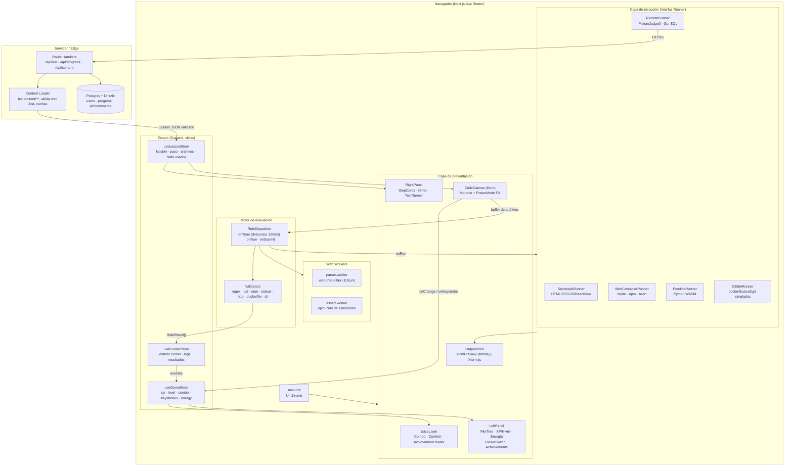

# Arquitectura — CodeQuest (plataforma gamificada de aprendizaje técnico)

> Entregable 1: arquitectura del sistema, estructura de carpetas y decisiones clave.
> Estado: diseño aprobado para implementación. Fase 0–1 en curso (ver `ROADMAP.md`).

---

## 1. Principios rectores

1. **El contenido es datos, no código.** Una lección es un JSON validado por schema. Nadie escribe React para añadir una lección. Esto es lo que permite escalar a cientos de lecciones y traducirlas sin tocar la app.
2. **Ejecución detrás de una interfaz única (`Runner`).** Sandpack, WebContainers, Pyodide, un runner remoto y el simulador de CLI implementan el mismo contrato. La UI no sabe cuál está corriendo.
3. **El hilo de UI es sagrado.** El "juice" (combos, partículas, shake) corre a 60fps. Parseo, linting y tests van a Web Workers. Un análisis de sintaxis nunca puede tragarse un keystroke.
4. **La gamificación es una capa de observación, no de acoplamiento.** El store escucha eventos (`keystroke`, `rule:failed`, `step:passed`) y deriva XP/combo/logros. El motor de evaluación no sabe qué es el XP.
5. **Bilingüe desde el día 0, no como retrofit.** Si el ES/EN no está en el schema desde la primera lección, se paga 10x después.

---

## 2. Diagrama de componentes



**Flujo de un keystroke** (la ruta caliente, la que hay que mantener barata):

```
tecla → Monaco onChange
      ├─→ useGameStore.registerKeystroke()   [síncrono, ~0 coste]  → combo, contador, FX
      └─→ RuleDispatcher.scheduleTypeCheck() [debounce 120ms]
              → parser.worker (AST/lint)
              → reglas con when:"type"
              → RuleResult[] → decorations Monaco (shake rojo) + energy--
```

---

## 3. Estructura de carpetas

```
cod-ing/
├── content/                          # ⚠️ CONTENIDO = DATOS. Sin lógica aquí.
│   ├── schema/
│   │   └── lesson.schema.json        # generado desde Zod (para $schema en VSCode)
│   ├── lessons/
│   │   ├── frontend/
│   │   │   ├── html/  css/  javascript/  typescript/  react/  vue/  nextjs/
│   │   ├── backend/
│   │   │   ├── node/  python/  go/  sql/  api-design/
│   │   └── devops/
│   │       ├── bash/  linux/  docker/  compose/  ci-cd/  nginx/  k8s/
│   ├── tracks/                       # metadatos de ruta: orden, prerequisitos, boss lessons
│   │   ├── frontend.track.json
│   │   ├── backend.track.json
│   │   └── devops.track.json
│   └── achievements/
│       └── achievements.json         # catálogo bilingüe + triggers
│
├── messages/                         # i18n de la UI (next-intl). NO contenido de lecciones.
│   ├── es.json
│   └── en.json
│
├── src/
│   ├── app/
│   │   ├── [locale]/
│   │   │   ├── layout.tsx            # NextIntlClientProvider + shell
│   │   │   ├── page.tsx              # dashboard / mapa de mundos
│   │   │   ├── tracks/[track]/page.tsx
│   │   │   └── play/[track]/[lesson]/page.tsx   # ← la pantalla de juego
│   │   ├── api/
│   │   │   ├── run/route.ts          # proxy a Piston/Judge0 (rate-limited)
│   │   │   ├── progress/route.ts
│   │   │   └── content/[...slug]/route.ts
│   │   └── globals.css
│   │
│   ├── components/
│   │   ├── layout/          GameShell · LeftPanel · RightPanel · OutputDock
│   │   ├── editor/          CodeCanvas · PowerModeFX · DamageDecorations · FileTree
│   │   ├── terminal/        XtermPane · useXterm · ansi.ts
│   │   ├── preview/         DomPreview (iframe sandbox) · SandpackPreview
│   │   ├── gamification/    XpBar · LevelBadge · EnergyBar · ComboCounter
│   │   │                    AchievementToast · KeystrokeCounter · ConfettiLayer
│   │   ├── lesson/          StepCard · HintCard · TestResultList · InterviewBrief
│   │   └── ui/              primitivas (Button, Card, Panel, Tooltip)
│   │
│   ├── lib/
│   │   ├── content/
│   │   │   ├── types.ts              # tipos TS derivados de Zod
│   │   │   ├── lesson.schema.ts      # ← FUENTE DE VERDAD (Zod)
│   │   │   ├── loader.ts             # carga + valida + cachea
│   │   │   └── localize.ts           # pick(LocalizedText, locale) con fallback
│   │   ├── engine/
│   │   │   ├── dispatcher.ts         # orquesta reglas por fase
│   │   │   ├── validators/
│   │   │   │   ├── regex.ts  ast.ts  dom.ts  stdout.ts
│   │   │   │   ├── http.ts   unit-test.ts
│   │   │   │   ├── dockerfile.ts     # parser + reglas de buenas prácticas
│   │   │   │   └── cli-transcript.ts
│   │   │   └── index.ts              # registry: RuleKind → Validator
│   │   ├── runners/
│   │   │   ├── types.ts              # interfaz Runner (contrato único)
│   │   │   ├── sandpack.ts  webcontainer.ts  pyodide.ts
│   │   │   ├── remote.ts             # Piston/Judge0 vía /api/run
│   │   │   ├── cli-sim/              # FS virtual + comandos docker/kubectl/git
│   │   │   └── factory.ts            # RuntimeSpec → Runner
│   │   ├── game/
│   │   │   ├── xp.ts                 # curvas de nivel, cálculo de XP
│   │   │   ├── combo.ts              # ventana, decay, multiplicador
│   │   │   └── achievements.ts       # evaluación de triggers
│   │   └── db/                       # Drizzle: schema.ts, queries.ts
│   │
│   ├── stores/
│   │   ├── useGameStore.ts           # ← Entregable 3
│   │   ├── useLessonStore.ts
│   │   └── useRunnerStore.ts
│   │
│   ├── workers/
│   │   ├── parser.worker.ts
│   │   └── assert.worker.ts
│   │
│   ├── i18n/
│   │   ├── routing.ts                # locales: ['es','en'], defaultLocale: 'es'
│   │   └── request.ts
│   └── middleware.ts                 # next-intl middleware
│
├── scripts/
│   ├── generate-json-schema.ts       # Zod → content/schema/lesson.schema.json
│   ├── validate-content.ts           # CI: valida TODAS las lecciones
│   └── check-i18n-parity.ts          # CI: falla si falta una traducción
│
├── docs/
│   ├── ARCHITECTURE.md               # este archivo
│   ├── ROADMAP.md
│   └── AUTHORING.md                  # guía para crear lecciones
└── tests/
```

---

## 4. Decisiones de arquitectura (ADR compactos)

### ADR-01 · Bilingüe co-locado en la lección, separado en la UI

- **UI chrome** (botones, menús, toasts) → `messages/{es,en}.json` con `next-intl`. Es el caso de uso estándar.
- **Contenido de lecciones** → objeto `LocalizedText = { es, en }` **dentro del mismo JSON de la lección**, no en archivos paralelos `lesson.es.json` / `lesson.en.json`.

**Por qué:** los archivos paralelos se desincronizan en cuanto añades un paso. Con `LocalizedText` inline, el schema Zod *obliga* a que ambos idiomas existan al añadir un paso — es imposible mergear una lección a medio traducir. El coste (JSON más verboso) es real pero se paga una vez; la deuda de contenido desincronizado se paga para siempre.

**Cambio de idioma sin perder progreso:** el progreso se indexa por `lessonId` + `stepId`, que son *invariantes de locale*. Cambiar el idioma solo re-renderiza texto; el buffer del editor, el combo y el XP viven en stores que no conocen el locale.

### ADR-02 · Interfaz `Runner` única

```ts
interface Runner {
  readonly kind: RuntimeKind;
  boot(spec: RuntimeSpec, files: FileMap): Promise<void>;
  writeFile(path: string, content: string): Promise<void>;
  run(cmd?: string): Promise<RunResult>;   // { exitCode, stdout, stderr, artifacts }
  onOutput(cb: (chunk: OutputChunk) => void): Unsubscribe;
  reset(): Promise<void>;
  dispose(): void;
}
```

Cinco implementaciones. La UI (`OutputDock`) solo decide **iframe vs xterm** según `runner.kind`. Añadir Rust mañana = una implementación nueva, cero cambios en la UI.

### ADR-03 · Docker/K8s: simulación determinista, no ejecución real

**Esto es lo más importante de todo el documento.** No existe forma de correr un demonio de Docker o un cluster de Kubernetes dentro de un navegador. Cualquier diseño que lo asuma se estrella en la semana 3.

La estrategia de tres capas para DevOps:

| Capa | Qué valida | Cómo |
|---|---|---|
| **Estática** | El Dockerfile/YAML/nginx.conf está bien escrito y sigue buenas prácticas | Parser propio + reglas (`dockerfile-lint`: orden de capas para cache, usuario no-root, multi-stage, `.dockerignore`) |
| **Simulada** | El usuario sabe *qué comandos* ejecutar y en qué orden | `CliSimRunner`: FS virtual + tabla de comandos con salidas pregrabadas y realistas, incluyendo salida de error si el comando es incorrecto |
| **Real (Node/bash)** | Scripts de bash, npm, git, servidores Node | `WebContainerRunner` — esto sí es un Linux real en WASM |

La simulación no es un atajo pedagógico: para "¿en qué orden pones `COPY package.json` y `COPY . .` para aprovechar la caché?" la validación estática es *mejor* que ejecutar Docker, porque puede explicar **por qué** falla la caché.

### ADR-04 · Cross-origin isolation aislada por ruta

WebContainers exige `COOP: same-origin` + `COEP: require-corp`. Aplicarlo globalmente rompe fuentes de Google, imágenes externas y cualquier embed. Solución: los headers se aplican **solo** bajo `/play/(backend|devops)/**` vía `next.config.ts` `headers()`, y los assets de esas rutas se sirven self-hosted. Sandpack y Pyodide no requieren aislamiento y viven sin restricción.

> Nota comercial a validar antes de lanzar: WebContainers (StackBlitz) requiere licencia para uso comercial. El diseño con `Runner` intercambiable es precisamente el seguro contra esto — si la licencia no encaja, `WebContainerRunner` se sustituye por `RemoteRunner` sin tocar UI ni contenido.

### ADR-05 · Validation-on-type sin bloquear el hilo

- Debounce de **120ms** desde el último keystroke (por debajo del umbral de percepción, por encima del ruido de tecleo).
- El parseo va a `parser.worker` (web-tree-sitter para AST multi-lenguaje; ESLint solo para JS/TS).
- El worker devuelve diagnósticos → `RuleDispatcher` los cruza con las reglas `when:"type"` del paso actual → Monaco `deltaDecorations` pinta la línea con `.line-damage` (shake + glow rojo).
- **Regla anti-frustración:** una regla `when:"type"` con `severity:"damage"` no dispara durante los primeros 800ms de un token incompleto. Nadie debe recibir daño por estar a medio escribir `func`.

### ADR-07 · La terminal interactiva mueve WebContainers al centro del producto

**Contexto.** Requisito nuevo: el usuario debe poder abrir una consola e instalar
frameworks y herramientas él mismo (`npm install`, `npm create vite@latest`), no que
la plataforma lo prepare por detrás.

**Consecuencia sobre ADR-04.** Sandpack empaqueta React/Vue en el navegador pero **no
tiene npm**: no hay forma de instalar un paquete arbitrario ni de teclear un comando.
Solo WebContainers ofrece un Node y un shell reales. Eso significa que las lecciones de
framework de frontend también necesitan cross-origin isolation, y los headers dejan de
aplicarse solo a `/play/(backend|devops)/**`.

Como aplicarlos globalmente rompería recursos externos, la regla pasa a ser **por
lección y no por track**: el layout de `/play/**` lee `lesson.runtime.kind` y solo las
rutas cuyo runtime sea `webcontainer` reciben COOP/COEP. Frontend queda partido:

| Tipo de lección | Runtime | Aislamiento |
|---|---|---|
| HTML/CSS/JS puro | `dom` | no |
| React/Vue sin instalación | `sandpack` | no |
| React/Vue con terminal y npm | `webcontainer` | **sí** |

**Consecuencia sobre el riesgo.** La licencia comercial de WebContainers pasa de ser un
riesgo del track de backend a ser un riesgo del producto entero. `RemoteRunner` no es
sustituto aquí: un runner remoto ejecuta un fichero y devuelve stdout; no da una sesión
de shell interactiva con FS persistente. Si la licencia no encaja, las alternativas
reales son contenedores efímeros propios en servidor (coste e infraestructura muy
superiores) o renunciar a la instalación interactiva y quedarse en Sandpack.

**Decidir antes de escribir contenido que dependa de ello.** Las lecciones marcadas
`runtime.kind: "webcontainer"` son las que quedarían huérfanas.

### ADR-08 · El workspace es mutable: `files` es el estado inicial, no la lista final

**Contexto.** Requisito nuevo: árbol de directorios navegable, con archivos que el
usuario crea y con lo que generen las herramientas (`npm create vue` escribe decenas de
archivos), para que el ejercicio se parezca a un proyecto real.

**Decisión.** `workspace.files` pasa a significar "con qué arranca el ejercicio". La
verdad del FS durante la sesión la tiene el runner, y el árbol es su reflejo.

Campos nuevos en el schema:

```jsonc
"workspace": {
  "files": [ /* estado inicial */ ],
  "entry": "src/main.js",
  "allowCreate": true,          // el usuario puede crear archivos
  "allowDelete": false,         // …y borrarlos
  "protectedPaths": ["tests/"]  // ni renombrar ni borrar: sostienen la evaluación
}
```

**Sincronización.** Es el punto delicado y donde se irá el tiempo de la Fase 3.5: el
FS del runner es la fuente de verdad, el store se suscribe a sus cambios, y las
escrituras del editor van al runner (no al revés). Hacerlo bidireccional sin un dueño
claro produce archivos fantasma en cuanto un comando y el editor tocan lo mismo.

**Coste.** La evaluación se complica: una regla `regex-must` sobre `index.js` ya no
puede asumir que ese archivo existe. Los validadores necesitan un caso "archivo
ausente" con mensaje propio, en lugar de fallar con un error genérico.

**Rendimiento.** `node_modules` puede ser 300 MB y decenas de miles de entradas. El
árbol lo trata como nodo colapsado especial y no lo recorre nunca; sin esa excepción,
el primer `npm install` congela la pestaña.

### ADR-06 · Anti-cheat mínimo del combo

El combo cuenta keystrokes *productivos*: se ignoran teclas de navegación, y un pegado (`paste`) de más de 40 caracteres rompe el combo en vez de dispararlo. Sin esto, mantener la tecla `a` pulsada da "Coding Spree!" y la mecánica pierde todo su significado.

---

## 5. Modelo de datos de progreso (servidor)

```
users(id, email, locale, created_at)
user_stats(user_id, total_xp, level, total_keystrokes, best_combo, streak_days)
lesson_progress(user_id, lesson_id, status, step_index, xp_earned,
                hints_used, attempts, best_time_ms, code_snapshot, updated_at)
user_achievements(user_id, achievement_id, unlocked_at)
```

`code_snapshot` (JSONB con el `FileMap`) permite reanudar exactamente donde se dejó, incluso tras cambiar de idioma o de dispositivo.

---

## 6. Riesgos identificados

| Riesgo | Impacto | Mitigación |
|---|---|---|
| Licencia comercial de WebContainers | Alto | ADR-02: runner intercambiable por `RemoteRunner` |
| Coste/abuso del runner remoto (Go, SQL) | Medio | Rate limiting por usuario en `/api/run`, cola, timeout 10s |
| Volumen de autoría de contenido bilingüe | **Alto** | Es el cuello de botella real del proyecto, no la tecnología. `AUTHORING.md` + validación en CI + una lección "plantilla" por arquetipo |
| Bundle de Monaco (~5MB) | Medio | Carga dinámica, solo los lenguajes del track activo |
| FX de partículas en móvil/portátiles modestos | Bajo | Respetar `prefers-reduced-motion` + toggle "Modo rendimiento" |
